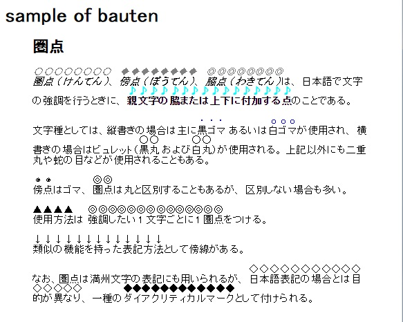
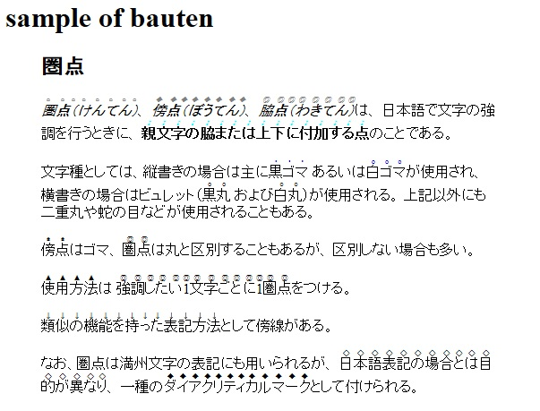

bauten.js - text-emphasis
=========================

## 概要

HTMLページ内の特定要素のテキストを日本語的な「傍点(圏点)」で表現する為のjavascriptです。
CSSで「傍点」を表現する`text-emphasis`に対応していないブラウザでも、ある程度互換性のある表現が可能です。

テキスト中の各文字を、ルビ(RUBY～RB～RT)に変換します。
実行時にブラウザのCSS対応状況はチェックしていませんので、対応ブラウザでも同じ変換が行われます。

## 機能

* 特定要素の文字に傍点をつけます。
* 任意の要素を指定できます。
* 傍点のスタイルを指定可能。
* 複数の傍点を処理可能です。

### 動作確認

動作の確認は、Chromeと、IE11だけで行いました。

## 使い方

HTMLの任意の場所でbauten.jsを読み込めば、_既定の変換対象_の要素に傍点が打たれます。

```
<script type="text/javascript" src="bauten.js"></script>
```

## 既定の変換

既定の変換対象は、`bauten-text-emphasis`クラスが設定されている要素です。

表示される傍点はドット(`filled dot`)になります。

## 変換対象と、スタイルの変更方法

変換対象とスタイルを変更するには、bauten関数を使います。

__書式__

bauten(style, ...);

__パラメータ__

style - 変換対象を指定するセレクタと、傍点のスタイルを指定するオブジェクト

__説明__

一度この関数を呼び出すと既定の変換は行われません。

定義は一度に複数与えることが可能です。

`bauten`の呼び出し時点でスタイルは適用されません。ページ内容が読み込まれた後です。

### パラメータの書式の詳細

```
style = {
    'tagName':  `<タグ名>`,         // 変換対象の要素名
    'className':`<クラス名>`,       // 変換対象のクラス名
    'style':    `<傍点のスタイル>`, // 必須
    'color':    `<傍点の色>`,       // 省略可能
}
```

#### tagNameとclassName

tagNameとclassNameのどちらか必須（両方指定された場合はAND条件）。

#### style

styleは、CSSの`text-emphasis-style`と同じ書式で指定します(以下)

__text-emphasis-style:__  
`none` | [ [ `filled` | `open` ] || [ `dot` | `circle` | `double-circle` | `triangle` | `sesame` ] ] | `<string>`


但し、noneは処理を行わないので指定する意味がありません。

filledとopenは省略可能です。
filled は省略可能で、傍点が塗りつぶされることを意味し、openは、傍点が白抜きになります。

その他、各指定の組み合わせで何がどのように表示されるかは[sample.html](sample.html)を表示して確認してください。
以降に画面ショットも掲載しています。

#### color

colorは、CSSの色指定。傍点のみの色が変更されます。指定しなければ文脈上の色が使用されます。

### 呼び出し例

#### 要素名で指定

以下のようにすれば、ページ内の全てのSTRONG要素のテキストに傍点を打ちます。

```
<script type="text/javascript" src="bauten.js"></script>
<script type="text/javascript">
bauten({'tagName': 'STRONG', 'style': 'dot'});
</script>
```

#### クラス名による指定

変換対象は、クラスで指定できます。

```
<script type="text/javascript" src="bauten.js"></script>
<script type="text/javascript">
bauten({'className': 'text-emphasis', 'style': 'open'});
</script>
```

#### 要素名とクラス名の組み合わせで指定する

```
<script type="text/javascript" src="bauten.js"></script>
<script type="text/javascript">
bauten(
    { 'tagName': 'EM', 'className': 'text-emphasis',
        style': 'open dot' },
    { 'tagName': 'STRONG', 'className': 'text-emphasis',
        'style': 'filled circle', 'color':'blue' }
);
</script>
```

## 参考


### 表示サンプル

以下のスクリーンショットは、[sample.html](sample.html)を各ブラウザで表示したものです。

#### Chromeでの表示



#### Internet Exploer 11 での表示



LICENSE
-------

```
The MIT License (MIT)

Copyright (c) 2015 Koji Takami

Permission is hereby granted, free of charge, to any person obtaining a copy
of this software and associated documentation files (the "Software"), to deal
in the Software without restriction, including without limitation the rights
to use, copy, modify, merge, publish, distribute, sublicense, and/or sell
copies of the Software, and to permit persons to whom the Software is
furnished to do so, subject to the following conditions:

The above copyright notice and this permission notice shall be included in all
copies or substantial portions of the Software.

THE SOFTWARE IS PROVIDED "AS IS", WITHOUT WARRANTY OF ANY KIND, EXPRESS OR
IMPLIED, INCLUDING BUT NOT LIMITED TO THE WARRANTIES OF MERCHANTABILITY,
FITNESS FOR A PARTICULAR PURPOSE AND NONINFRINGEMENT. IN NO EVENT SHALL THE
AUTHORS OR COPYRIGHT HOLDERS BE LIABLE FOR ANY CLAIM, DAMAGES OR OTHER
LIABILITY, WHETHER IN AN ACTION OF CONTRACT, TORT OR OTHERWISE, ARISING FROM,
OUT OF OR IN CONNECTION WITH THE SOFTWARE OR THE USE OR OTHER DEALINGS IN THE
SOFTWARE.
```
